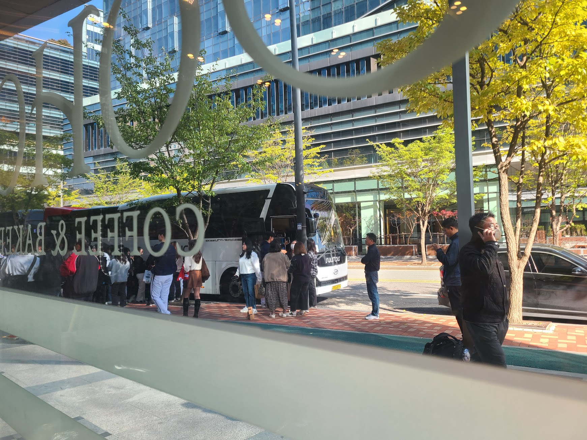

## 문제 1

Q: 다음 이미지에 대한 설명 중 옳지 않은 것은 무엇인가요?
- (1) 많은 사람들이 큰 홀에서 컴퓨터를 사용하고 있습니다.
- (2) 이미지에 'DIVE 2024 IN BUSAN'이라는 문구가 보입니다.
- (3) 대부분의 사람들이 서로 마주 보고 앉아 있습니다.
- (4) 중앙의 스크린은 흰색 배경에 빨간색 글씨로 구성되어 있습니다.

정답: (4) 중앙의 스크린은 흰색 배경에 빨간색 글씨로 구성된 것이 아닙니다.

---------------------

## 문제 2

Q: 이미지에 대한 설명 중 옳지 않은 것은 무엇인가요?
- (1) 노란색 조형물이 눈에 띕니다.
- (2) 건물 위쪽에 "Local Stitch" 라는 글자가 보입니다.
- (3) 빌딩은 주로 흰색과 파란색으로 칠해져 있습니다.
- (4) 조형물 옆에 앉을 수 있는 벤치가 있습니다.

정답: (3) 빌딩은 주로 흰색과 파란색이 아니라 회색과 빨간색으로 칠해져 있습니다.

---------------------

## 문제 3

Q: 다음 이미지에 대한 설명 중 옳지 않은 것은 무엇인가요?
- (1) 실내는 밝고 넓은 공간으로 구성되어 있습니다.
- (2) 벽의 일부분은 노란색으로 칠해져 있습니다.
- (3) 카운터 앞에 많은 사람들이 줄 서 있습니다.
- (4) 카페 내부에 여러 개의 테이블과 의자가 배치되어 있습니다.

정답: (3) 카운터 앞에 많은 사람들이 줄 서 있는 것이 아닙니다.

---------------------

## 문제 4

Q: 다음 이미지에 대한 설명 중 옳지 않은 것은 무엇인가요?
- (1) 건물은 벽돌로 이루어져 있습니다.
- (2) 1층에는 "PERSONAL COFFEE"라는 글자가 보입니다.
- (3) 사진에는 차가 여러 대 보입니다.
- (4) 건물의 외벽에는 에어컨 실외기가 설치되어 있습니다.

정답: (3) 사진에는 차가 보이지 않습니다.

---------------------

## 문제 5

Q: 다음 이미지에 대한 설명 중 옳지 않은 것은 무엇인가요?
- (1) 다양한 종류의 빵이 진열되어 있습니다.
- (2) 진열대에 가격표가 붙어 있습니다.
- (3) 점원이 손님을 응대하고 있는 모습이 보입니다.
- (4) 진열대 위에 머핀처럼 보이는 빵이 있습니다.

정답: (3) 점원이 손님을 응대하고 있는 모습은 보이지 않습니다.

---------------------

## 문제 6

Q: 다음 이미지에 대한 설명 중 옳지 않은 것은 무엇인가요?
- (1) 사람들이 건물 앞에서 작업을 하고 있습니다.
- (2) 녹색 간판의 가게 이름은 '뉴트리코어'입니다.
- (3) 작업 중인 사람들은 모두 같은 색 모자를 쓰고 있습니다.
- (4) 베이커리 카페의 간판에 'pomne verte'라고 적혀 있습니다.

정답: (3) 작업 중인 사람들은 모두 같은 색 모자를 쓰고 있지 않습니다.

---------------------

## 문제 7

Q: 다음 이미지에 대한 설명 중 옳지 않은 것은 무엇인가요?
- (1) 이미지는 넓은 카페 내부를 보여줍니다.
- (2) 창문을 통해 바깥의 나무들이 보입니다.
- (3) 가운데 테이블에 사람들로 가득 차 있습니다.
- (4) 전반적으로 조명이 어두운 분위기입니다.

정답: (3) 가운데 테이블은 비어 있습니다.

---------------------

## 문제 8

Q: 다음 이미지에 대한 설명 중 옳지 않은 것은 무엇인가요?

- (1) 사람들이 버스 앞에 줄을 서 있습니다.
- (2) 앞에는 COFFEE & BAKERY라는 글자가 보입니다.
- (3) 이미지에는 푸른 하늘이 보입니다.
- (4) 몇몇 사람들이 가방을 들고 있습니다.

정답: (3) 이미지에는 푸른 하늘이 보이지 않습니다.

---------------------

